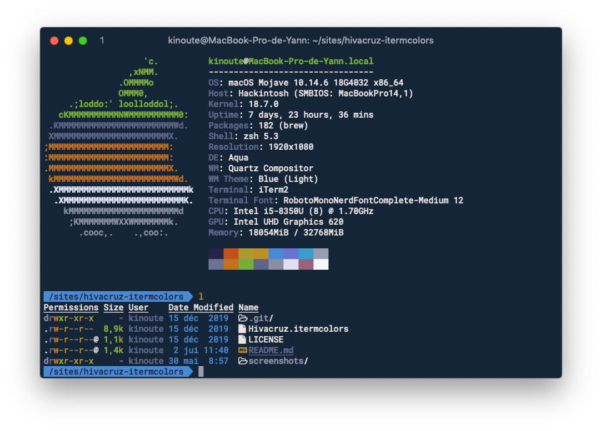
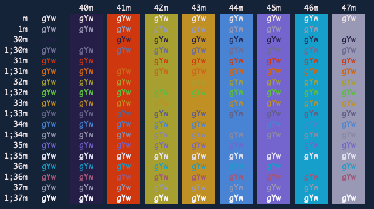

# Hivacruz iTerm Color Scheme

A color scheme I made for iTerm2 to fit my own [Sublime Text theme](https://github.com/kinoute/hivacruz-sublime-theme).



## Installation

I'm using the **Roboto Mono Medium for Powerline** with it (size 12). You can install the font with Homebrew like this:

```sh
brew tap homebrew/cask-fonts
brew cask install font-roboto-mono
brew cask install font-roboto-mono-for-powerline
```
### Download with git

Clone the repository:

```sh
git clone https://github.com/kinoute/hivacruz-itermcolors.git
```

### Download manually

Download the [.zip archive](https://github.com/kinoute/hivacruz-itermcolors/archive/master.zip) and unzip it.

### Activate the theme

1. Go to `iTerm2 > Preferences > Profiles > Colors Tab`
2. Click `Load Presets`
3. Click `Import`
4. Select the `your/path/to/Hivacruz.itermcolors` file
5. Select the _Hivacruz_ color scheme from `Load Presets`

You can delete the repository after you imported the theme.

## Colors Table

Using the __Monaco__ font, size 13:



## Credits

Created by Yann Defretin. [My Sublime Text theme](https://github.com/kinoute/hivacruz-sublime-theme) that inspired this repo was itself inspired by [Coda 2.5](https://panic.com/coda)'s Panic Palette written by Cabel Sasser.

